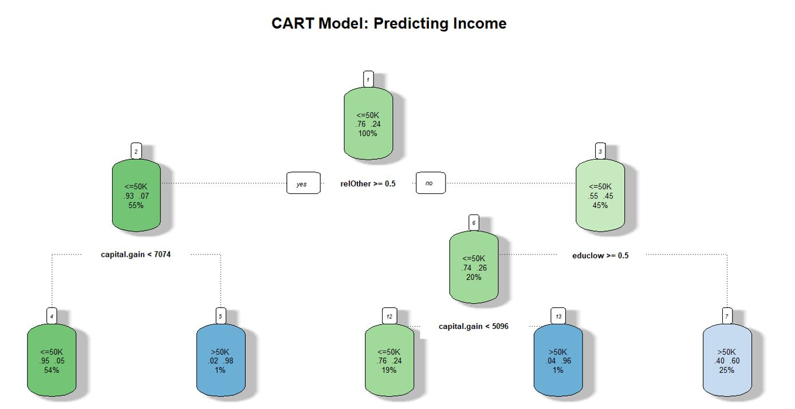
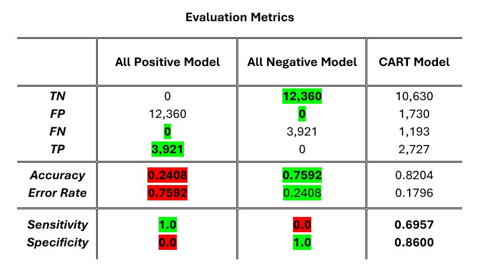

# High Income Earners — Classification Model

A CART (classification and regression tree) model that predicts whether a person earns above $50k/year, built on the 1994 US Census dataset (32,561 records). The goal is to find the decision rules that best separate high-income from low-income earners using demographic and financial features.

## What it covers

- Data preprocessing and imputation
- Baseline model comparison
- CART model with decision rule extraction
- Model evaluation: accuracy, sensitivity, specificity

## Results

| Metric | Value |
|---|---|
| Accuracy | 82.04% (vs 75.91% baseline) |
| High-income earners correctly predicted | 67.04% |
| Low-income earners correctly predicted | 86.01% |

**Key decision rules extracted:**
- Married + high education → high income (60% confidence, 25% support)
- Married + high education + capital gain > $5,096 → high income (96% confidence)
- Unmarried + capital gain > $7,074 → high income (98% confidence)

## Stack

R, R Markdown — `rpart`, `rpart.plot`, `caret`

## Run it

Requires R and RStudio.

```r
# Open and knit:
high income earners.Rmd
```

Data source: [UCI Adult Dataset](https://archive.ics.uci.edu/ml/datasets/adult)

## Visualizations



