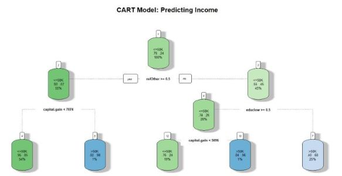

# High income earners

A classification and regression tree (CART) was used to predict income level based on
education level, net capital gains and marital status using a dataset of 32,561 records. 
High income earners make up 26% of all records. Baseline models were constructed to 
compare CART model metrics against. The accuracy, error rate, sensitivity and 
specificity were calculated for each model. Notable conclusions from analysis are as 
follows:

• The CART model achieved an accuracy of 82.04% which outperformed the 
baseline model of 75.92% accuracy by 6.13%. Error rate was also decreased by 
6.13%.

• 67.04% of the high-income earners and 86.01% of the low-income earners were 
predicted correctly by the CART model.

• If a subject is married and has high education, they are high-income earners with 
25% support and 60% confidence. 

• If a subject is married, has high education and capital gain > 5,096, they are 
predicted as high-income earners with 96% confidence and 1% support. 

• If a subject is unmarried and has net capital gain > 7,074, they are high-income 
earners with 1% support and 98% confidence. Only 6.62% of all unmarried 
subjects are high income earners, so high capital gain plays a significant role in 
this outcome. 

Conclusion: 

• To target high income customers, the focus should be on customers who are 
married and have some college education or higher, or customers who are married 
with capital gain > 5,096. Alternatively, for unmarried customers, targets should 
focus on those with capital gain greater than 7,074. 

Donors: Ronny Kohavi and Barry Becker
Data Mining and Visualization
Silicon Graphics.

Data source: https://archive.ics.uci.edu/ml/datasets/adult
